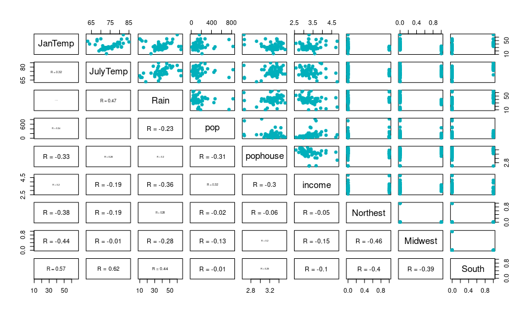

Finally, you find me here!

I am a graduate student in George Washington University, working in the GWU JITR Lab. I am interested in  statistics, computer science, data analytics, and machine learning.

Here are my <a href="./projects.html"> projects </a>.

<table>
<tr>
  <td class="left">
    
  </td>
  <td class="right">
    
  </td>
</tr>
<tr>
  <td class="left">
    
  </td>
  <td class="right">
    
  </td>
</tr>
</table>
